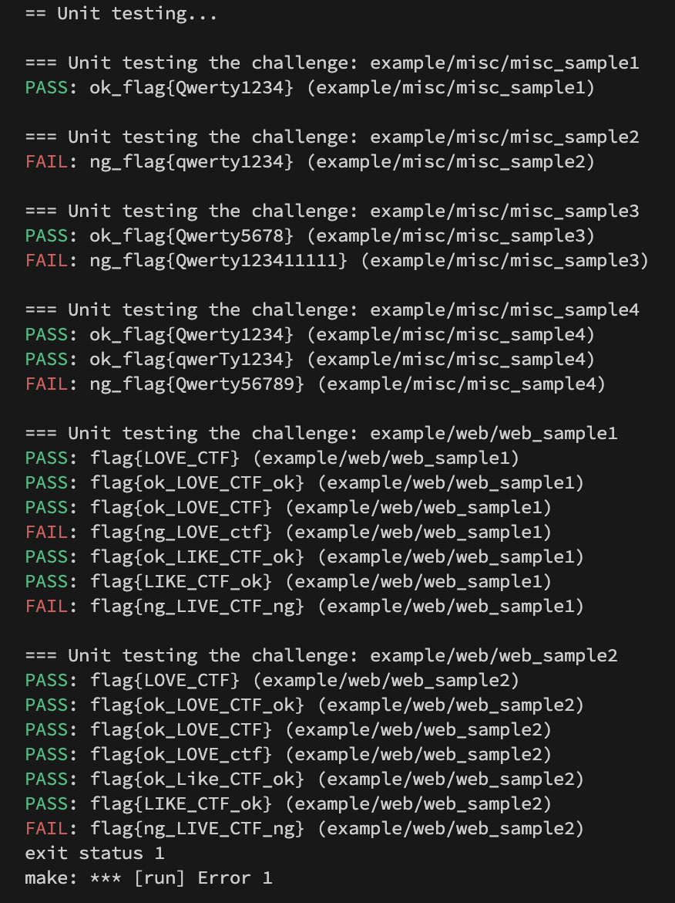

[](https://github.com/xryuseix/ctfcli-unit-test/actions/workflows/test.yaml)

# [Unit Test Tool for CTFd/ctfcli](https://github.com/CTFd/ctfcli)

## Usage

### Use with GitHub Actions

```yaml
name: Unit Test for CTFd/ctfcli

on:
  pull_request:
    branches: 
      - main

jobs:
  test:
    runs-on: ubuntu-latest

    steps:
      - uses: actions/checkout@v3

      - name: Unit Test for CTFd/ctfcli
        uses: xryuseix/ctfcli-unit-test@v1
        with:
          target_directory: example
```

### Use with Command Line

```bash
# try to run
make run
# for production
# change INPUT_TARGET_DIRECTORY
make build && INPUT_TARGET_DIRECTORY="example" ./out
```


